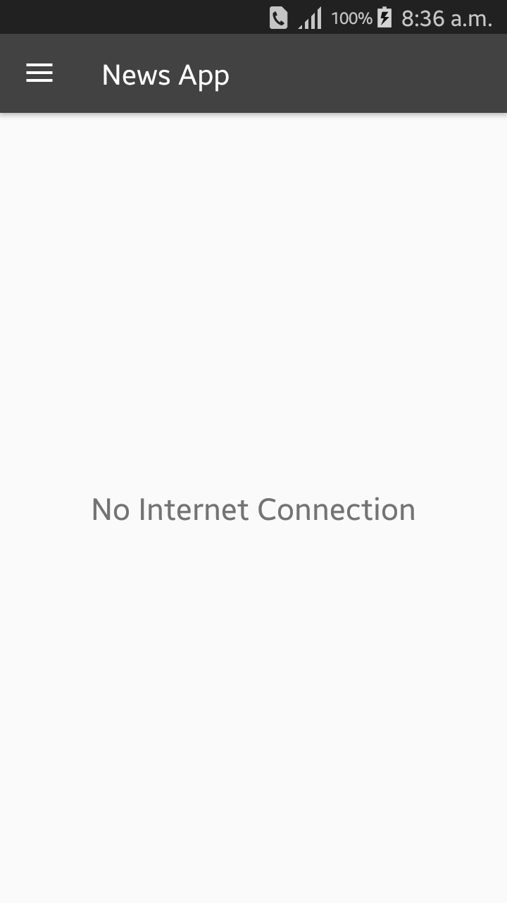
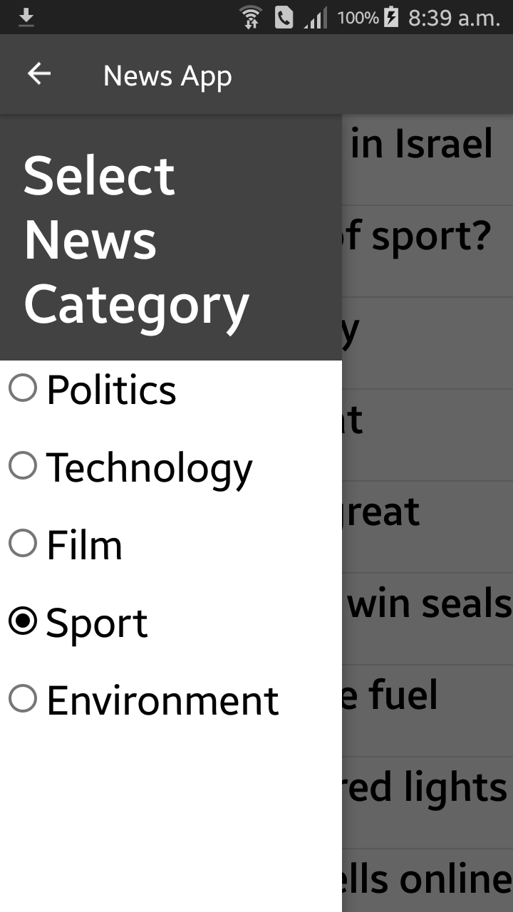
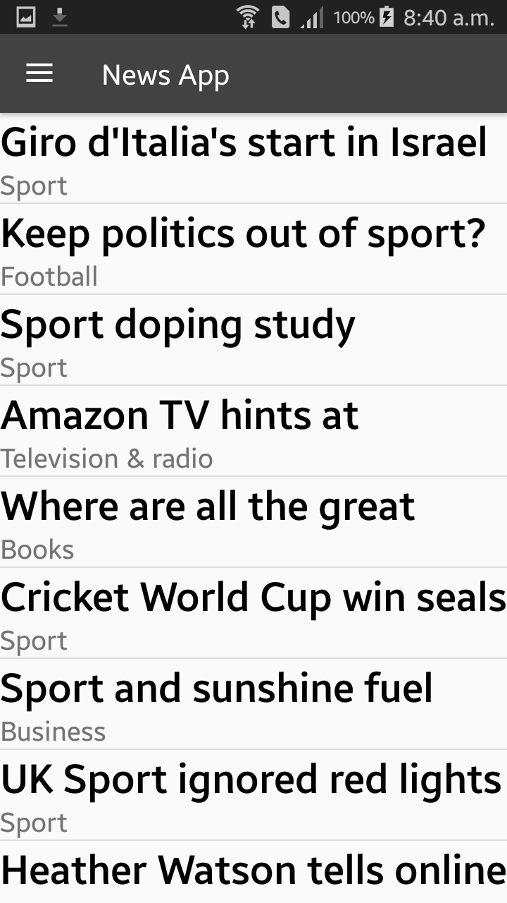

# NewsApp
NewsApp is an online application where user can find diffrenct types of newses by selecting different types of category. Then can read the full news by clicking on that news, it will take directly to The Guardian News website to show the full news.

## Home Page
This is the home page of the application. If there is no internet connection then it will thow this message in the home page.

## Navigation Drawer
In the navigation drawer user will find some category. He/she can choose any category 

Then all the news of that type of category will be shown in the home page.

## Selection
User can select any news to read it in full details.

## Full News
After selecting any news, it will open in a browser to show the details of that news.

